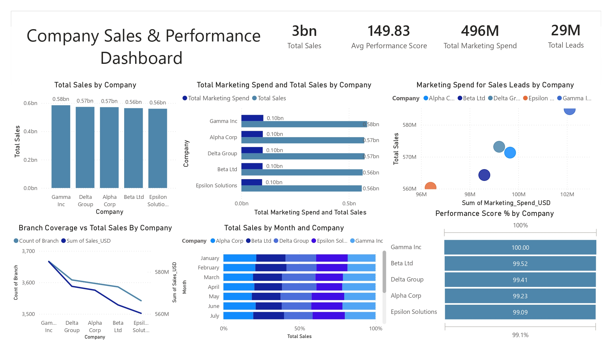

# Company Sales & Performance Dashboard

## Project Overview

This Power BI dashboard provides a comprehensive view of company sales performance, marketing effectiveness, lead generation, and operational efficiency across multiple business units.

The dashboard enables executives and business managers to monitor revenue growth, marketing ROI, performance scores, and branch-level contributions through interactive visual analytics.

---

## Dashboard Preview

## Key Metrics

| KPI | Value |
|------|--------|
| Total Sales | $3 Billion |
| Average Performance Score | 149.83 |
| Total Marketing Spend | $496 Million |
| Total Leads Generated | 29 Million |

---

## Dashboard Features

### 1. Sales Performance by Company
Compares total revenue generated across:

- Alpha Corp
- Beta Ltd
- Gamma Inc
- Delta Group
- Epsilon Solutions

Helps identify top-performing business units.

---

### 2. Marketing Spend vs Sales Analysis
Evaluates the relationship between:

- Marketing investment
- Revenue generation

Supports ROI and budget allocation decisions.

---

### 3. Lead Generation Efficiency
Visualizes how marketing spending influences lead acquisition and sales outcomes.

Key metrics include:
- Marketing Spend
- Sales Revenue
- Lead Volume

---

### 4. Branch Coverage Analysis
Measures operational reach through:

- Number of Branches
- Sales Contribution

Identifies opportunities for geographic expansion.

---

### 5. Monthly Sales Performance
Tracks monthly revenue contribution across companies and highlights seasonal sales patterns.

---

### 6. Performance Score Comparison
Ranks companies based on performance indicators and operational effectiveness.

---

## Business Objectives

- Monitor company-wide sales performance
- Evaluate marketing campaign effectiveness
- Optimize marketing investments
- Track lead generation efficiency
- Measure operational performance
- Support executive decision-making

---

## Key Insights

### Revenue Leaders
- Gamma Inc records the highest sales performance.
- Delta Group and Alpha Corp closely follow in revenue generation.

### Marketing Effectiveness
- Companies with higher marketing investment generally achieve stronger sales outcomes.
- Marketing spend shows a positive correlation with lead generation.

### Operational Performance
- All companies maintain performance scores above 99%.
- Branch expansion contributes significantly to sales growth.

### Strategic Opportunities
- Optimize marketing allocation based on ROI.
- Improve lead conversion efficiency.
- Expand branch networks in high-performing regions.

---

## Tools & Technologies

- Power BI
- DAX
- Power Query
- Excel / CSV Dataset
- Data Modeling
- Business Intelligence Reporting

---

## Dashboard Preview

.jpg)

---

## Skills Demonstrated

- Sales Analytics
- Marketing Analytics
- KPI Development
- Executive Dashboard Design
- DAX Measures
- Data Modeling
- Power Query
- Business Intelligence Reporting
- Data Visualization

---

## Business Value

This dashboard helps organizations:

- Increase revenue visibility
- Improve marketing ROI
- Monitor company performance
- Optimize resource allocation
- Track lead generation effectiveness
- Support strategic growth initiatives

---

## Author

Yashwanth Katuru

Aspiring Data Analyst | Power BI Developer | Business Intelligence Enthusiast
